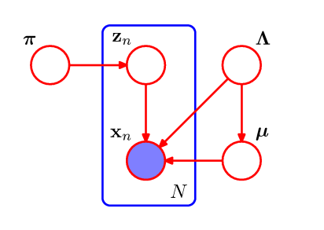
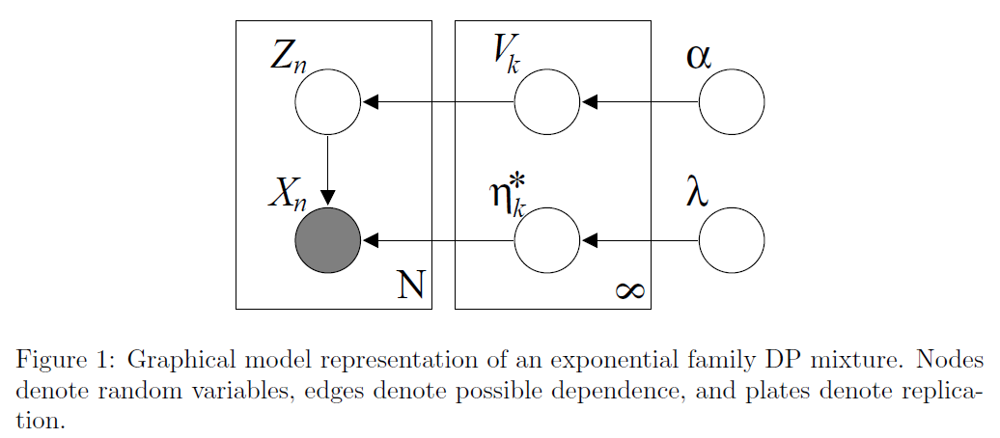

## Conjugate Bayesian analysis for the Gaussian distribution

Suppose the data conforms the univariate Gaussian distribution. If the variance $\sigma^2$ is known ( a given constant) but the mean $\mu$ is unknown, which is the quantity to be estimated. In Bayesian inference, the mean is a random variable. To do Bayesian inference, we need to choose a prior. Using conjugate prior makes the problem simpler because the posterior can be written in close form and we do not need to do (numerical) calculus. 

For the known variance case, if we choose the prior as Gaussian distribution $N(\mu_0, \sigma_0)$, which is the distribution of $\mu$. Then the posterior is also Gaussian with mean 
$$
\begin{align}
\mu_n & = \frac{\sigma^2 \mu_0 + n \sigma_0^2 \bar{x}}{n\sigma_0^2 + \sigma^2} \\
\sigma_n^2 &= \frac{\sigma^2 \sigma_0^2}{n \sigma_0^2 + \sigma^2}
\end{align}
$$

## EM GMM

In Expectation Maximization for Gaussian Mixture Model, we further assume there are $n$ hidden random variables $Z_i$. $X_i | Z_i \sim N(\mu_i, \Sigma_i)$ and each $Z_i$ is multinomial distributed  with parameter ($\pi_1, \dots, \pi_K$). for each data point $x_i$, the probability it belongs to $k$ cluster is $P(Z_i = k | X_i = x_i)$ which can be computed by Bayesian posterior law. This is E Step task. For M Step, we should update the old hyper-parameter $\theta = \cup_{i=1}^K\{\pi_i, \mu_i, \Sigma_i\}$ by maximization the expectation of log likelihood:
$$
\int \log p(x,z | \theta) p(z | x, \theta_{\textrm{old}}) dz
$$
This maximization problem has close form solution. Therefore we can update $\theta$ from $\theta_{\textrm{old}}$ , $P(Z_i = k | X_i = x_i)$ and observation $x$. 

## Variational Inference for Dirichlet process mixtures

### Finite Case

Like EM GMM, we assume a pre-determined number of cluster $K$.  And we have a bunch of hyper-parameters  $\alpha, \beta, m, W, v $.  $\alpha$ is the parameter of the Dirichlet prior. For $\beta, m, W, v$, these four are parameters of Normal-Inverse Wishart prior $p(\mu, \Sigma) = N(\mu | m, \beta^{-1} \Sigma)W(\Sigma^{-1}| W, v)$. We assume $X_i | Z_i \sim N(\mu_i, \Sigma_i)$ as EM GMM. But $(\mu_i, \Sigma_i)$ are random vectors sampled from Normal-Inverse Wishart distribution. Also $Z_i$ is a multinomial distributed random variable but its parameter $\pi = (\pi_1, \dots, \pi_K)$ is a random vector sampled from symmetric Dirichlet distribution with parameter $\alpha_0$.  What we should do is the same as above, in E step, we estimate $P(Z_i = k | X_i = x_i)$ from old hyper-parameters. In M step, we update the hyper-parameters.  The theory behind these update rules are variational inference, which is different from non-Bayesian EM foundation.

Notice that in later update the Dirichlet distribution is not symmetric any more and we use $D(\alpha_1, \dots, \alpha_K)$ to represent the updated parameter. To make notation concise we use $r_{ik} = P(Z_i=k | X_i = x_i)$. The M step parameter update rule is:
$$
\begin{align}
\alpha_k &= \sum_{i=1}^n r_{ik} + \alpha_0 \\
\beta_k &= \beta_0 + \sum_{i=1}^n r_{ik} \\
\end{align}
$$
This method is first proposed by Hagai [2000]. The theory uses a pre-determined form to approximate $p(Z,\theta | X)$. That is a factorized form $q(Z,\theta | X) = q(Z | X) q(\theta | X)$.  Then to minimize the $\textrm{KL}(q(Z,\theta | X) | p(Z,\theta | X))$ is equivalent to maximize a term called evidence lower bound:
$$
F[q] = \int q(Z,\theta | X) \log\frac{p(Z,\theta,X)}{q(Z,\theta | X)}dZd\theta
$$
We can show that $F[q] + \textrm{KL}(q(Z,\theta | X) || p(Z,\theta | X)) = \log p(X)$.

In our problem, since the data $X$ is given, we can omit the condition on $X$ without misinterpretation. 

Then we can write
$$
F[q]= \int q(Z)q(\theta) \log \frac{p(Z,\theta,X)}{q(Z)q(\theta)}dZd\theta
$$

In E-Step, we compute $q(Z)$ by solving $\frac{\delta F}{\delta q(Z)} = 0$. The result is $q(Z) \propto \exp(\int q(\theta) \log p(Z,\theta, X)d\theta)$.

In M-Step, we compute $q(\theta)$ by solving $\frac{\delta F}{\delta q(\theta)} = 0$. The result is $q(\theta) \propto \exp(\int q(Z) \log p(Z,\theta, X)dZ)$

Reference: [Probabilistic Inference](https://www.doc.ic.ac.uk/~dfg/ProbabilisticInference/IDAPISlides17_18.pdf)

[E-Step deduction]To compute $q(Z_n = k | X_n)$ we have $ p(Z_n = k, X_n | \theta) = \pi_k N(\mu_k, \Sigma_k)$. Then 
$$
\log q(Z_n = k | X_n) \propto E_{\pi, \mu, \Lambda}(\frac{1}{2}\log|\Lambda_k|-\frac{1}{2}(x_n - \mu_k)^T \Lambda_k (x_n - \mu_k) + \log \pi_k)
$$
$\Lambda_k$ is the precision matrix and we assume $x$ is d dimensional. 

Then we have 
$$
q(Z_n = k | X_n ) \propto \tilde{\pi}_k^{1/2} \tilde{\Lambda}_k \exp(-\frac{d}{2\beta_k} - \frac{v}{2}(x_n - m_k)^T W (x_n - m_k))
$$
where $\log \tilde{\pi}_k = E[\log \pi_k] = \psi(\alpha_k) - \psi(\sum_{i=1}^K\alpha_i)$ and $\log \tilde{\Lambda}_k = E[\log |\Lambda_k|]=\phi_d(\frac{v}{2}) + \log|W| + d\log2$.

Where $\psi_d$ is the multivariate digamma function.

[M-Step deduction] $\theta = (\pi, \mu, \Lambda)$. From the graphical model, $q(\theta) = q(\pi) q(\mu, \Lambda)$. For $\log q(\pi) \propto E_{Z}[\log p(Z | \pi) + \log p(\pi | \alpha_0)]$. 

Therefore
$$
\begin{align}
\log q(\pi) &= \sum_{i=1}^n p(Z_i | \pi) + \sum_{j=1}^K (\alpha_0 - 1)\log \pi_j + C\\
&= \sum_{j=1}^K (\sum_{i=1}^n r_{ij} + \alpha_0 - 1) + C
\end{align}
$$
Therefore, the posterior $\pi$ is also Dirichlet distributed random vector but with updated parameter.

To compute $q(\mu, \Lambda)$, what we need to do is to complete some square terms for $E_{Z_k} [\log p(X | Z_k) ] + \log N(m_0, \beta_0^{-1}\Sigma_k) + \log W(W_0, v_0) $. The complete expansion is as follows:
$$
\frac{1}{2}\sum_{i=1}^N r_{nk}(\log | \Lambda_k |  - (x_n - \mu_k)^T \Lambda_k (x_n - \mu_k))+\frac{1}{2}\log |\beta_0 \Lambda_k| -\frac{1}{2}(\mu_k - m_0)^T (\beta_0 \Lambda_k)(\mu_k - m_0)+\frac{v_0 - d -1}{2} \log | \Lambda_k | - \frac{1}{2} \textrm{tr}(W_0^{-1} \Lambda_k)
$$
We can combine $v_0$ with $\sum_{i=1}^N r_{nk}$ to form updated $v$. $(x_n - \mu_k)$ should be expanded with $(x_n - \bar{x}) - (\mu_k - \bar{x})$ such that the summation over cross term is zero in $\sum_{i=1}^N r_{nk} (x_n -\mu_k)^T \Lambda_k (x_n - \mu_k)$. Therefore, $\bar{x} = \frac{1}{N} \sum_{n=1}^N r_{nk} x_n$. Then we make the square for $\mu_k$ term and get the updated formula for $m$:
$$
m = \frac{\beta_0 m_0 + (\sum_{n=1}^N r_{nk})\bar{x}}{\beta_0 + \sum_{n=1}^N r_{nk}}
$$
The updated formula for $\beta$ is also easily get:
$$
\beta = \beta_0 + \sum_{n=1}^N r_{nk}
$$
Finally, the updated formula for $W^{-1}$ is gotten:
$$
W^{-1} = W_0^{-1} + \sum_{n=1}^N r_{nk}(x_n - \bar{x})^T\Lambda_k(x_n - \bar{x}) +\frac{\beta_0 (\sum_{n=1}^N r_{nk})(\bar{x}-m_0)^T \Lambda_k (\bar{x} - m_0)}{\beta_0 + \sum_{n=1}^N r_{nk}}
$$

### Infinite Case

The latent variables are $(Z_n, V_k, \eta_k)$.  $V_i | \alpha \sim \textrm{Beta}(1, \alpha)$. 