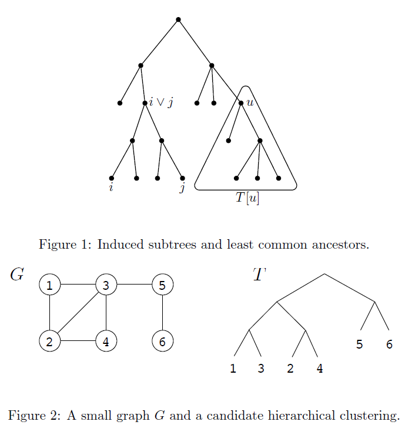
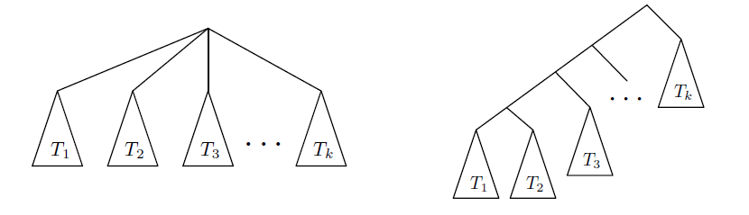
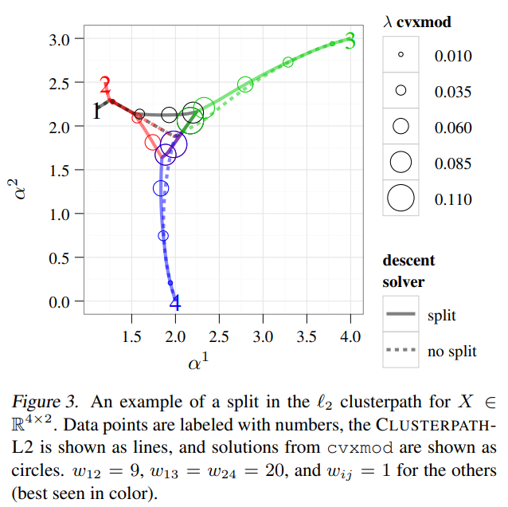

## Hierarchical Agglomerative Clustering

Abbreviated as HAC. It is a general framework to do hierarchical clustering based on either distance metric or similarity metric. Starting from cluster set $S = \{D_1, \dots, D_k\}$,

It selects two clusters based on $\max_{i,j} \textrm{sim}(D_i, D_j)$ or $\min_{i,j} \textrm{d}(D_i, D_j)$. Since $d(D_i, D_j)\geq 0$ we can let $\textrm{sim}(D_i, D_j) = \frac{1}{d(D_i, D_j)}$ and the optimal solution does not change.

After the choice of $i,j$, we construct $D'_{c} = D_i \cup D_j$ to replace $D_i$ and $D_j$.

If $d(D_i, D_j) = \min_{x_i \in D_i, x_j \in D_j} d(x_i, x_j)$, we call the method SLINK (single linkage clustering), which is the oldest hierarchical clustering method available (1973).

## Maximizing the mutual information between different clusters

For two random variables, their similarity is measured by the inner product of their probability density function as:
$$
\textrm{CEF}(p,q) = \int p(x) q(x)dx
$$
CEF is called the clustering evaluation function, using Parzen's Window estimator $P(x) = \frac{1}{N_r} \sum_{i=1}^{N_r} G(x-x_i, \sigma^2)$. The CEF reduces to
$$
\textrm{CEF}(p, q) = \frac{1}{2N_1 N_2} \sum_{i=1}^N\sum_{j=1}^NM(x_i,x_j) G(x_i - x_j, 2\sigma^2)
$$
The indicator function $M(x_i,x_j)$ is one when $x_i, x_j$ belongs to different clusters, otherwise it is zero.

One way to extend CEF to multiple cluster case is:
$$
\textrm{CEF}(p, q) = \frac{1}{2N_1 N_2 \dots N_C} \sum_{i=1}^N\sum_{j=1}^NM(x_i,x_j) G(x_i - x_j, 2\sigma^2)
$$
The criterion of CEF for multiple clusters is used as a guidance to iterate the labels. [2002 TPAMI]

The method should fix the number of cluster $C$. First we have a random label assignment, then we make a k nearest neighbor of each $x_i$ with size $k$ and within the label set of $x_i$. That is, we require the neighbors have the same label. We have at most $n$ sets, each set contains $k+1$ elements. If any two sets are identical, we keep only one. Next we exchange the label assignment of two set (they should have different label assignment) if this exchange can increase CEF. After this iteration, we decrease $k$ and repeat this process until $k$ reduces to 1. This scheme does not guarantee to find the global maximum of CEF but does give good approximation. We call this method ITC for short. 

## Maximizing the mutual information between samples and cluster labels

Abbreviated as MIC. Do not use KL-divergence because of computational difficulty.

Suppose there are $N$ samples and $n$ clusters.
$$
MI(C,x) = \sum_{p=1}^n\sum_{X} (P(C_p,x) - P(C_p)P(x))^2
$$
Estimating $P(C_p)$ from sample distribution directly. 

Use Mixture Gaussian model to describe $P(x), P(C_p,x)$. 
$$
\begin{align*}
P(x) &= \frac{1}{N} \sum_{i=1}^N G(x-x_i, \sigma^2) \\
P(C_p, x) &= \frac{1}{N_p} \sum_{k=1}^{N_p} G(x-x_{p,k}, \sigma^2)
\end{align*}
$$
Simplifying $MI(C,x)$ we can find it is irrelevant with variable $x$, it is a function of the flat clustering $C$. 

Use agglomerative hierarchical clustering to increase $MI(C,x)$ in each step (greedy algorithm). [ICIP 2007]

That is, to compute $\Delta MI(C,x)$ when two clusters $C_a, C_b$ are merged to $C_p$.

Ours: Minimizing the multivariate mutual information between different clusters.

## Bayesian Hierarchical Clustering

Abbreviated as BHC [ICML 2005].

Use Bayesian posterior probability to determine which two clusters to merge in the framework of agglomerative clustering.

Suppose there are $D_1, \dots, D_r$ clusters, each cluster consists of several points $D_k = \{x_{k_1},\dots x_{k_n}\}$

For any two clusters $D_i, D_j$, we can compute the posterior probability to merge them. Let $H^{k}_1$ be the prior probability that $D_i, D_j$

should be merged: $D_k = D_i \cup D_j$. $H_2^{k}$ is the counterpart. Let $\pi_k = \Pr(H_1^{k})$. Then 

$$
r_k = \Pr(H_1^k | D_k) = \frac{\pi_k \Pr(D_k | H_1^k)}{\pi_k \Pr(D_k | H_1^k) + (1-\pi_k)\Pr(D_k | H_2^k)}
$$

There are three components to compute in this posterior: $\pi_k, \Pr(D_k | H_1^k)$ and $\Pr(D_k | H_2^k)$

$\Pr(D_k | H_2^k)$ is easy to be decomposed as $\Pr(D_k | H_2^k)=Pr(D_i | T_i) \Pr(D_j | T_j)$

Under the hypotheses $H_1^k$, points $D_k$ are coming from the same distribution, $p(x|\theta)$. We choose $\theta = (\mu, \Sigma)$ where both $\mu$ and $\Sigma$ are unknown. Using Bayesian inference, we choose Normal-inverse-Wishart distribution as prior for $\theta$.  The prior has four parameters $\mu_0, \lambda, \Psi, \nu$.

The posterior of $\theta$ has close form solution. 
$$
\begin{align}
\mu_n & = \frac{\lambda \mu_0 + n \bar{x}}{\lambda + n} \\
\lambda_n & = \lambda + n \\
\nu_n & = \nu + n \\
\Psi_n &= \Psi + \sum_{i=1}^n (x_i - \bar{x})(x_i - \bar{x})^T + \frac{\lambda n}{\lambda + n}(\bar{x} - \mu_0)(\bar{x} - \mu_0)^T
\end{align}
$$
Also, the distribution for data can be obtained. That is
$$
\Pr(D_k | H_1^k) = \frac{\Gamma_d(\nu_n/2)}{\Gamma_d(\nu/2)}\frac{|\Psi|^{\nu/2}}{|\Psi_n|^{\nu_n/2}}\left(\frac{\lambda}{\lambda_n}\right)^{\frac{d}{2}}\pi^{-nd/2}
$$
Notice that $d$ is the dimension of $x$.

For the third quantity $\pi_k$, its formula comes from Dirichlet process:
$$
\begin{align}
\pi_k & = \frac{\alpha g(n_k)}{ d_k } \\
d_k &= \alpha g(n_k) + d(T_i) d(T_j)
\end{align}
$$
Notice that $\alpha$ is the concentration parameter. The larger $\alpha$ is, the larger the prior $\Pr(H_1^k)$ is. $g(n)$ is a function such that a probability that a new point joining an existing cluster is proportional to the number of data points already in that cluster.

Therefore, $g(n) = (n-1)g(n-1) \Rightarrow g(n) = (n-1)!$.

Suppose we get a flat clustering $D_1, \dots, D_r$ from the clustering tree, we can predict the belonging of new observations $x$ using MAP. That is, we compute $p(x| D_i)$ which has close form solution. Under our assumptions, we can deduct that the posterior of data is multivariate t-distribution. 
$$
p(x | D) = t_{\nu_n - d + 1}(x | \mu_n, \frac{\lambda_n + 1}{(\nu_n - d + 1)\lambda_n}\Psi_n)
$$

Reference: [BayesianGaussian](https://www.cs.ubc.ca/~murphyk/Papers/bayesGauss.pdf)

## Cost function on clustering tree

Given pairwise similarity between data points, we would like to find a clustering tree which minimizes the following cost function [STOC 2016]. (we say that $i\vee j$ is the lca of $i$ and $j$)
$$
\textrm{cost}_G(T) = \sum_{\{i,j\} \in E} w_{ij} |\textrm{leaves}(T[i\cup j])|
$$

Figure 2 shows an example to compute the cost given $G$ and $T$, the answer is 24.

Based on this cost function, the optimal clustering tree is binary. Exactly solving the optimization problem is NP-Hard. We can use an approximation method, which chooses a split $V \to (S, V \backslash S)$ according to the sparsest cut criterion and recurse on each half. The sparsest cut is
$$
\min_{S} \frac{w(S, V\backslash S)}{|S| |V \backslash S|}
$$

Solving the sparsest cut problem is also NP-hard. 

## Convex Fusion Penalties

For the data $x_1, \dots, x_n$, convex fusion method packs these data into data matrix $X \in \mathbb{R}^{n \times p}$ 

and solves a family of minimization problems:
$$
\begin{align}
\min_{\alpha \in \mathbb{R}^{n \times p}} & \frac{1}{2} || \alpha - X ||_F^2 \\
\textrm{subject to } & \Omega_q (\alpha) = \sum_{i < j} w_{ij} || \alpha_i - \alpha_j ||_q \leq t
\end{align}
$$
The parameter $t$ is chosen between $[0, \Omega_q(X)]$ and for different $t$ we can solve a data matrix $\alpha$ ( coordinate of $n$ points) and they form $n$ continuous curve for the parameter $t$. These curves join the same point when $t = 0$ and equals $x_i$ when $t = \Omega_q(X)$. Some curves will join together as $t$ decreases. We call these curves the clusterpath.

This method is first proposed by Toby Dylan in 2011.

## Gradient-based hyperbolic hierarchical clustering

This method is proposed by Nicholas Monath in 2019. Given d dimensional data, it used k points in hyperbolic space to describe the inner structure of the clustering tree. Notice that k is fixed in this method,

which is a restriction. The given normalized dataset are treated on the circumference of the Poincare ball.

The coordinates of these k points can be optimized based on a continuous objective

function. The objective function is constructed when 3 points are considered at each time. $w_{ij}$ is used to describe the similarity of two data points. Suppose $w_{ij} > \max\{w_{ik}, w_{jk}\}$, the goal is

to let the lca(least common ancestor) of $i,j$ be different from that of $i,j,k$. The objective function is denoted as $C_{gHHC}(X, Z)$ where $X$ is the dataset and $Z=\{z_1, \dots, z_k\}$ describes the internal structure of the clustering tree. Generally, the root node in $Z$ is neareast to the origin in the hyperbolic space. We use

$d_{cp}(T_c, T_p)$ to describe the distance between two points in $Z$, and we can get the parent node of $T_c$ by
$$
Parent(T_c) = \arg\min_{\substack{T_p \in N\\||z_p||<||z_c||}} d_{cp}(T_c, T_p)
$$

## Hierarchical DBSCAN

This method is proposed by Campello in 2015. The outlier detection is built-in since this method treats the non-core samples in original DBSCAN as outliers. I suspect HDBSCAN method is very similar with OPTICS method, which relaxes the condition of fixed `epsilon` to allow a range for `epsilon`. Therefore, OPTICS can generate a cluster hierarchy for a given dataset.

## Reference

1. AGHAGOLZADEH, M., SOLTANIAN-ZADEH, H., ARAABI, B. AND AGHAGOLZADEH, A. 2007. A hierarchical clustering based on mutual information maximization. In 2007 IEEE International Conference on Image Processing IEEE, I-277-I-280.
2. CAMPELLO, R.J., MOULAVI, D., ZIMEK, A. AND SANDER, J. 2015. Hierarchical density estimates for data clustering, visualization, and outlier detection. ACM Transactions on Knowledge Discovery from Data (TKDD) 10, 5.
3. DASGUPTA, S. 2016. A cost function for similarity-based hierarchical clustering. In Proceedings of the Proceedings of the forty-eighth annual ACM symposium on Theory of Computing, Cambridge, MA, USA2016 ACM, 2897527, 118-127.
4. GOKCAY, E. AND PRINCIPE, J.C. 2002. Information theoretic clustering. IEEE Transactions on Pattern Analysis and Machine Intelligence 24, 158-171.
5. HELLER, K.A. AND GHAHRAMANI, Z. 2005. Bayesian hierarchical clustering. In Proceedings of the 22nd international conference on Machine learning, 297-304.
6. HOCKING, T.D., JOULIN, A., BACH, F. AND VERT, J.-P. 2011. Clusterpath: an algorithm for clustering using convex fusion penalties. In Proceedings of the Proceedings of the 28th International Conference on International Conference on Machine Learning, Bellevue, Washington, USA2011 Omnipress, 3104576, 745-752.
7. MAXIMILLIAN, N. AND KIELA, D. 2017. Poincare Embeddings for Learning Hierarchical Representations. In Advances in Neural Information Processing Systems 30 Curran Associates, Inc., 6338--6347.
8. SIBSON, R. 1973. SLINK: An optimally efficient algorithm for the single-link cluster method. The Computer Journal 16, 30-34.